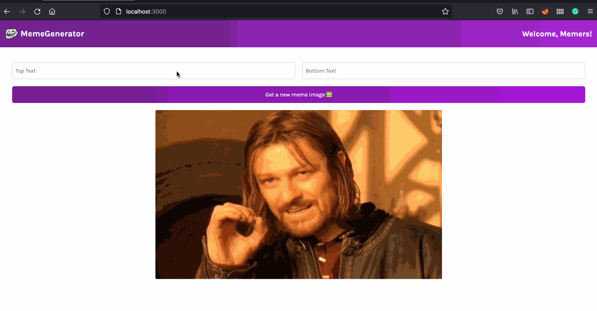

## Objective

The main purpose of this ReactJS app was to implement modern ReactJS practices through hooks such as useState() and useEffect() to create  a classic meme generator. In order to achieve this, I made an API call to an API with the top 100 most used memes and added a button event listener which randomly picks a meme image from the API and renders it to the DOM. As for the image text, I used form inputs to allow that allows the user to add text. **Through the use of ReactJS hooks, we were able to make this app responsive and allow it to dynamically update image text upon user action.**

### Desktop view of this app:

